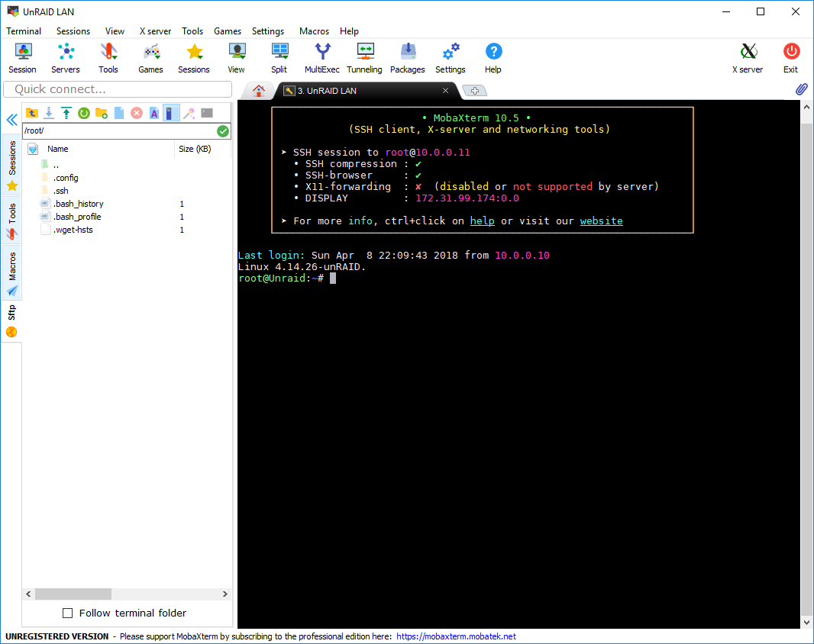

[TOC]

## What is a SSH client?
> An SSH client is a software program which uses the secure shell protocol to connect to a remote computer.
[Wikipedia](https://en.wikipedia.org/wiki/Comparison_of_SSH_clients)

SSH is the prefferd way to gain Secure Shell access to a machine, essentialy opening a terminal on the client to peform actions on the host.

### Other nifty things about SSH
Tunnels
Sftp

## What client to use
Depending on the OS on the machine you want to manage your server with, there is alot of different clients, ranging from just a terminal, to a more feature rich client. Some OSes even come with a preinstalled client.

This guide should help you choose a client.

## Linux

## Windows
At the time of writing, Windows doesnt come with native SSH support, therefore we need to download a third party client.

### MobaXTerm
[MobaXTerm](https://mobaxterm.mobatek.net/) is a versitile client, supporting most of your admin needs.It helps you stay organized, by saving credentials (Max. 12 sessions in the free versions) wich you can put in folders. You can have multible sessions open, as tabs. It also brings some linux commands to windows, like ls, grep and other populat commands.

#### Features
* Portable
* Lightweight
* Macros
* Other remote management protocols (COM, RDP, VNC)

## MacOS