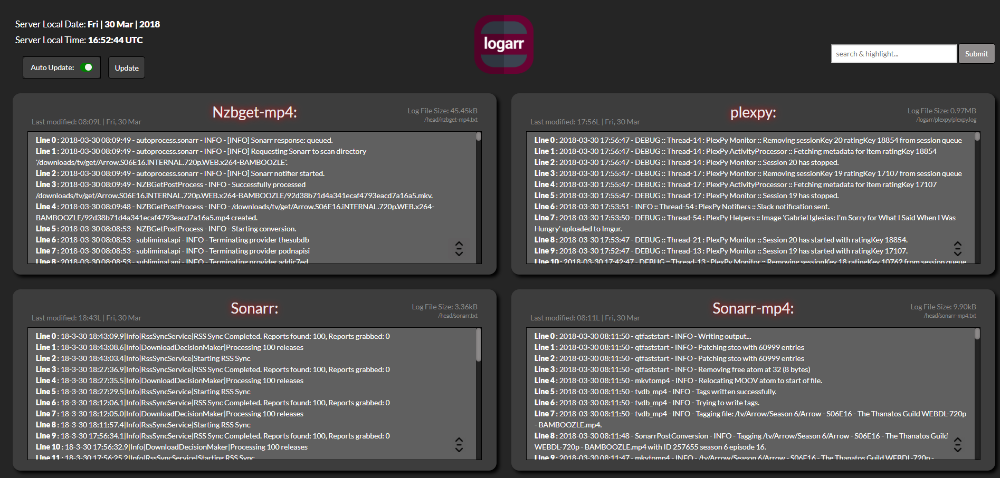

## [Logarr](https://github.com/Monitorr/logarr/tree/docker) is a Self-hosted, single-page, log consolidation tool written in PHP

A webpage to inspect logs, without using the terminal.

REPO IS BEEING BUILT

Nginx reverse proxy for subdomain
<pre><code class="nginx">
server { #Redirect non-ssl connections to ssl.
    listen 80;
    server_name logarr.FQDN.com;
    return 301 https://$host$request_uri;
}
 
server {
    listen 443 ssl http2;
    server_name logarr.FQDN.com;
 
    location / {
        proxy_pass http://10.0.0.11:4878/;
        add_header X-Frame-Options SAMEORIGIN;
        proxy_set_header Host $host;
        proxy_set_header X-Real-IP $remote_addr;
        proxy_set_header X-Forwarded-For $proxy_add_x_forwarded_for;
    	}
}
</code></pre>